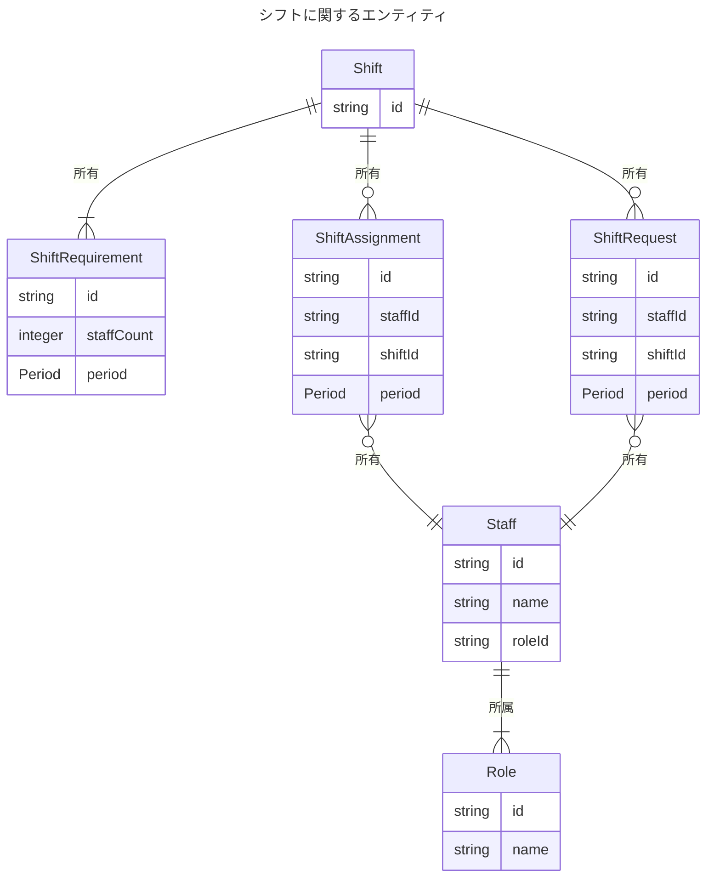

# エンティティ

```mermaid
---
title: シフトに関するエンティティ
---
erDiagram
    Shift {
        string id
    }

    ShiftRequirement {
        string id
        integer staffCount
        Period period
    }

    ShiftRequest {
        string id
        string staffId
        string shiftId
        Period period
    }

    ShiftAssignment {
        string id
        string staffId
        string shiftId
        Period period
    }

    Staff {
        string id
        string name
        string roleId
    }

    Role {
        string id
        string name
    }

    Shift ||--|{ ShiftRequirement : "所有"
    Shift ||--o{ ShiftRequest : "所有"
    Shift ||--o{ ShiftAssignment : "所有"

    ShiftAssignment }o--|| Staff : "所有"
    ShiftRequest }o--|| Staff : "所有"
    Staff ||--|{ Role : "所属"
```
