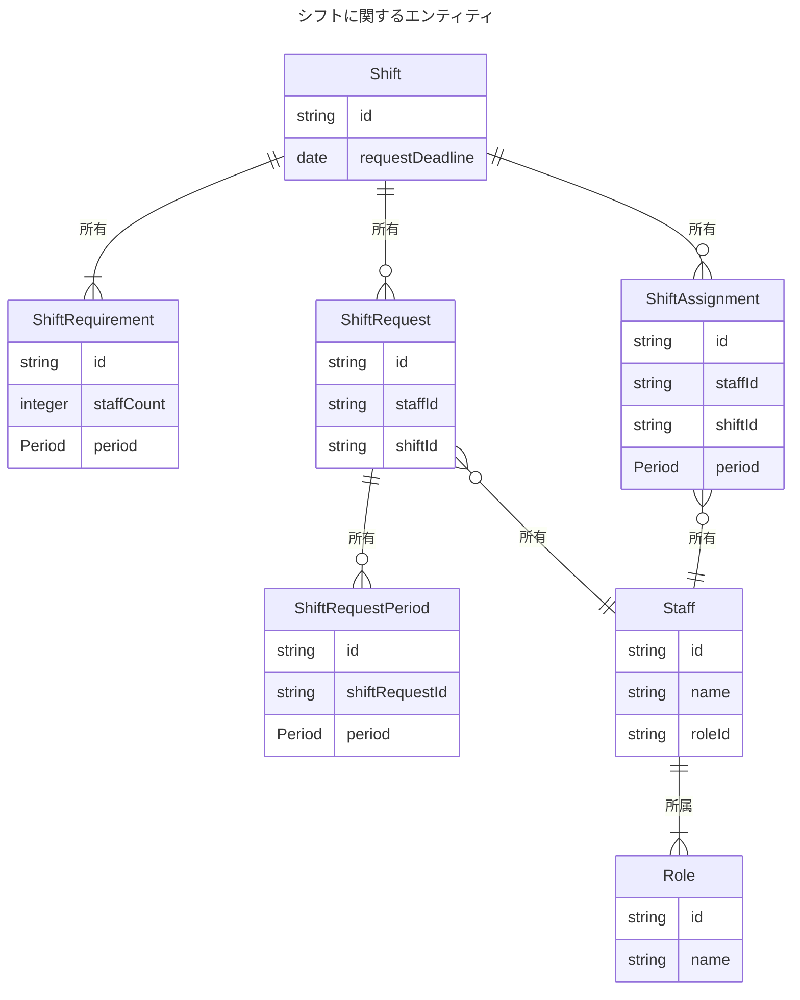
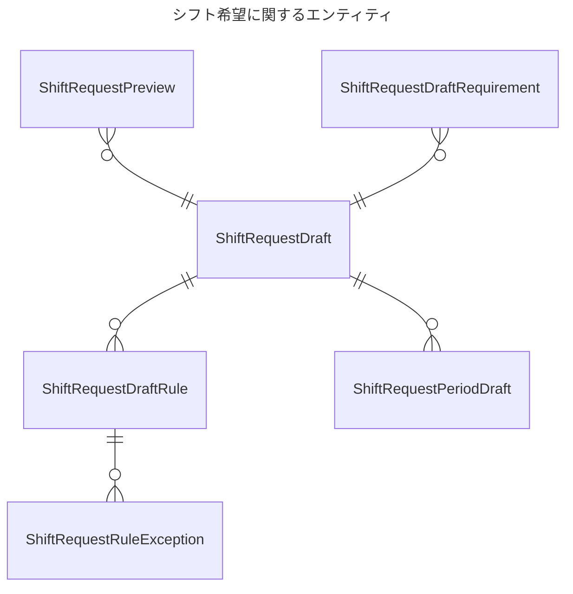

# 全体のエンティティ

## Shift

シフトを表すエンティティ。

## ShiftRequirement

シフトの必要人数を表すエンティティ。

## ShiftRequest

シフトの希望を表すエンティティ。

## ShiftAssignment

シフトの割り当てを表すエンティティ。

## Staff

スタッフを表すエンティティ。

## Role

役割を表すエンティティ。

# シフト希望に関するエンティティ

シフト希望を作成するときのエンティティ。

## ShiftRequestDraft

シフト希望の下書きを表すエンティティ。

## ShiftRequestDraftRequirement

既存のシフト要件を読み込んだ場合はそこから生成される。
あるいは期間を指定した場合は自動で作成される。

## ShiftRequestDraftRule

シフト希望の下書きのルールを表すエンティティ。
特定の曜日の繰り返しなどを表現する。

## ShiftRequestRuleException

シフト希望のルールの例外を表すエンティティ。
シフト希望の下書きのルールの例外としてルールを打ち消す。

## ShiftRequestPeriodDraft

シフト希望の下書きの期間を表すエンティティ。
ルールを使わない場合など直接記述する。
