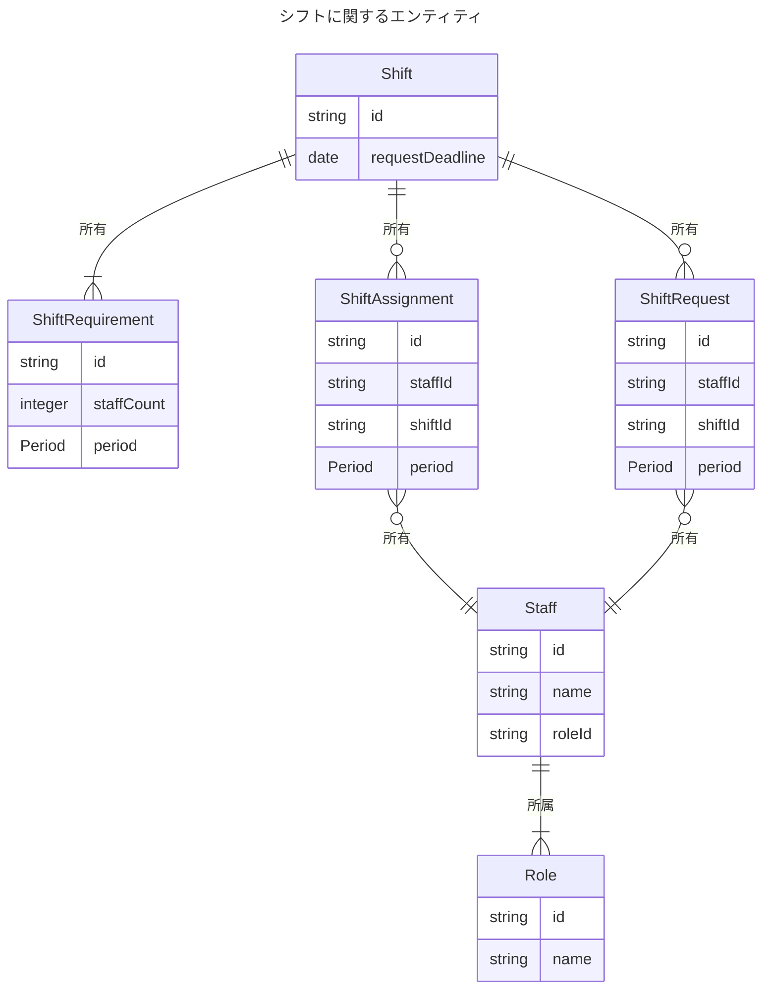

# エンティティ

## Shift

シフトを表すエンティティ。

## ShiftRequirement

シフトの必要人数を表すエンティティ。

## ShiftRequest

シフトの希望を表すエンティティ。

## ShiftAssignment

シフトの割り当てを表すエンティティ。

## Staff

スタッフを表すエンティティ。

## Role

役割を表すエンティティ。
